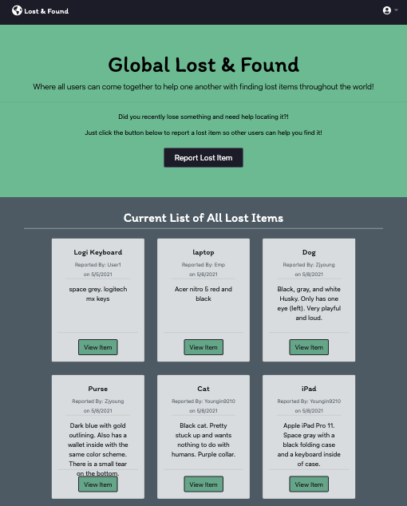

# Lost-Found

This webapp allows user to submit items they've lost and may not be able to retrieve themselves. Users can upload an item name, detailed description, and reward amount. The item is then placed on the homepage to make other users aware of the item. Items can then be reported found and the user who posted the item will be notified with an in app notification.

OSU Bootcamp Project #2

[Global Lost and Found](https://github.com/Youngin9210/Lost-Found)


## User Story

```md
As a user who lost an item,
I WANT to report a lost item,
SO THAT other users can help me find the lost item, given the information that is provided(name, last known location, color, last date seen)
```

## Acceptance Criteria

```md
WHEN I visit the site for the first time
THEN I am presented with a home page that includes lost items and navigation links to homepage, lost items, and login/logout
WHEN I click homepage
THEN I am taken to the homepage
WHEN I chose to sign up
THEN I am prompted to create a username and a password
WHEN I click on the sign up button
THEN My user credentials are save and I am logged in
WHEN I am signed in
THEN the logout option appears in the navbar
WHEN I click on lost item in the navbar
THEN I am presented with a responsively designed list of lost items and an option to add a lost item or change and item to found
WHEN I click on add a lost item
THEN I am prompted to enter item name, last known location, color, and last date seen
WHEN I click logout
THEN I am signed out of the site
```

## Authors

* **Kyle Young** - *Programmer* - [Youngin9210](https://github.com/Youngin9210)
* **Dalton Wilkins** - *Programmer* - [dalto135](https://github.com/dalto135)
* **William Farnsworth** - *Programmer* - [Cynwise](https://github.com/Cynwise)

## Acknowledgments

* The OSU coding boot camp, its Instructor and TAs who fielded questions regarding this project.
